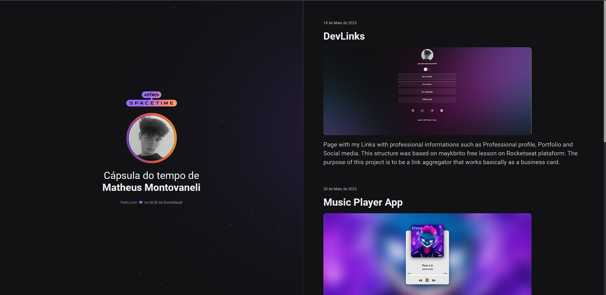
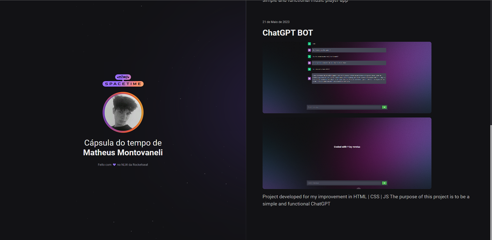

  <a href="#-technologies">Technologies</a>&nbsp;&nbsp;&nbsp;|&nbsp;&nbsp;&nbsp;
  <a href="#-project">Project</a>&nbsp;&nbsp;&nbsp;|&nbsp;&nbsp;&nbsp;
  <a href="#-layout">Layout</a>&nbsp;&nbsp;&nbsp;|&nbsp;&nbsp;&nbsp;
  <a href="#memo-licence">Licence</a>

  

  
  

 

 

## 🚀 Technologies 
This project was developed during Rocketseat's NLW with the following technologies:
- HTML
- CSS
- Git e Github

## 🖥️ Project
This is a Responsive Time Capsule web design to display memories on a timeline.

## 🏷️ Layout
You can preview the project layout through
[THIS LINK](https://www.figma.com/file/xllhBAkuLVflqR1WB9SzTj/Capsula-do-Tempo---Trilha-Explorer?type=design&node-id=306%3A3&t=l2mqywaCaALXnqil-1). 
It's necessary to have an account on [Figma](https://www.figma.com)

## :memo: Licence

This project is lincensed under the MIT license.

---